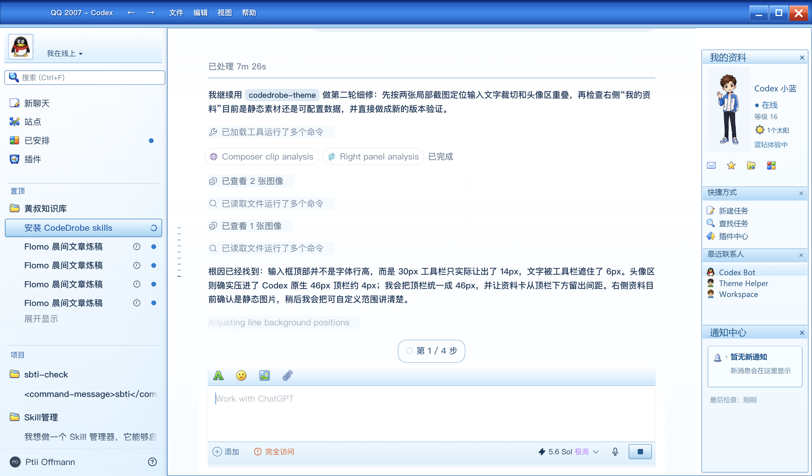

# QQ 2007 Codex Theme

一款为 OpenAI Codex 桌面端制作的 QQ 2007 怀旧主题。



## 下载

[下载 QQ 2007 Codex Theme v1.1.57](releases/QQ-2007-Codex-v1.1.57.codedrobe-theme)

SHA-256：

```text
d1fcf2c6c411882b18ae6f566af1fb53e3365dffd3564ec8e34673c4692ea900
```

## 兼容性

- 目标应用：OpenAI Codex 桌面端
- 当前主题版本：v1.1.57
- 主要针对 macOS 优化
- Windows 尚未完成视觉验证
- 推荐 CodeDrobe Core：0.3.0
- Node.js：22.4 或以上

## 安装

下载主题包后，将文件放入 `Downloads`。首次安装前请完全退出 Codex，然后运行：

```bash
npx --yes @codedrobe/core@0.3.0 theme inspect \
  "$HOME/Downloads/QQ-2007-Codex-v1.1.57.codedrobe-theme"

npx --yes @codedrobe/core@0.3.0 apply \
  --app codex \
  --theme "$HOME/Downloads/QQ-2007-Codex-v1.1.57.codedrobe-theme"
```

也可以把主题包拖入 Codex，并发送：

> 请使用 CodeDrobe Core 0.3.0 检查、应用并验证这个 `.codedrobe-theme` 文件。如需关闭或重启 Codex，请先询问我；完成后生成验证截图。

## 验证

```bash
npx --yes @codedrobe/core@0.3.0 verify \
  --app codex \
  --theme "$HOME/Downloads/QQ-2007-Codex-v1.1.57.codedrobe-theme" \
  --screenshot "$HOME/Desktop/qq2007-theme-check.png"
```

## 恢复默认主题

```bash
npx --yes @codedrobe/core@0.3.0 restore --app codex
```

## 注意事项

- 主题使用 CodeDrobe 在运行时应用，不会修改或重新签名 Codex 应用包。
- Codex 完全退出后，可能需要重新执行 `apply`。
- Codex 界面结构更新后，部分装饰性布局可能需要适配新版本。
- 安装前建议运行 `theme inspect` 检查主题包。
