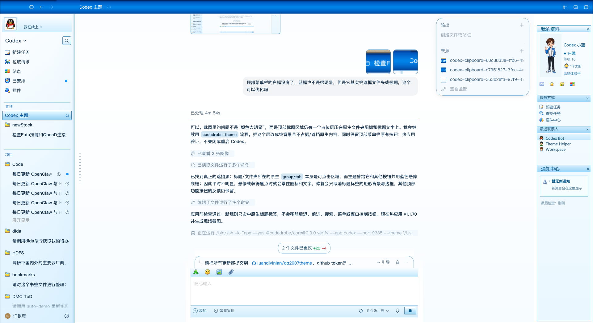

# QQ 2007 Codex + Chat/Work Theme

一款为 OpenAI Codex / ChatGPT 桌面端制作的 QQ 2007 怀旧主题，同时适配 Codex、ChatGPT Chat 和 ChatGPT Work 场景。



## 下载

[下载 QQ 2007 Codex + Chat/Work v1.1.70](releases/QQ-2007-Codex-Chat-Work-v1.1.70.codedrobe-theme)

SHA-256：

```text
bcafd459cd23c98c805f873cf9ae590f08f7f09620f832c891c8784c1a1524fa
```

旧版 v1.1.57 仍保留在 [`releases/`](releases/) 中。

## v1.1.70 功能

- 保留并适配 Codex / ChatGPT 原生模式切换。
- Codex 与 ChatGPT 切换按钮位于搜索按钮左侧。
- 保留顶部菜单栏的原生功能按钮。
- ChatGPT Chat / Work 当前模式使用蓝色选中状态。
- 修复 Work 输入框第一行被工具栏遮挡的问题，并移除多余空行。
- 隐藏 Chat 输入框内部的黄色焦点横线。
- 移除顶部菜单栏多余的白色、蓝色矩形占位层。
- 防止顶部标题或文件夹图标被标题标签的背景框遮挡。

完整变更说明见 [CHANGELOG.md](CHANGELOG.md)。

## 兼容性

- 目标应用：OpenAI Codex / ChatGPT 桌面端
- 当前主题版本：v1.1.70
- 主要针对 macOS 优化
- Windows 尚未完成视觉验证
- 推荐 CodeDrobe Core：0.3.0
- Node.js：22.4 或以上

## 安装

下载主题包后运行：

```bash
npx --yes @codedrobe/core@0.3.0 theme inspect \
  "$HOME/Downloads/QQ-2007-Codex-Chat-Work-v1.1.70.codedrobe-theme"

npx --yes @codedrobe/core@0.3.0 apply \
  --app codex \
  --theme "$HOME/Downloads/QQ-2007-Codex-Chat-Work-v1.1.70.codedrobe-theme"
```

也可以把主题包拖入 Codex，并发送：

> 请使用 CodeDrobe Core 0.3.0 检查、应用并验证这个 `.codedrobe-theme` 文件。如需关闭或重启 Codex，请先询问我；完成后生成验证截图。

如果 Codex 已通过 CodeDrobe 调试端口运行，主题可以热应用，无需重启；否则应先征得用户同意再重启。

## 验证

```bash
npx --yes @codedrobe/core@0.3.0 verify \
  --app codex \
  --theme "$HOME/Downloads/QQ-2007-Codex-Chat-Work-v1.1.70.codedrobe-theme" \
  --screenshot "$HOME/Desktop/qq2007-theme-check.png"
```

## 源文件

可编辑主题源文件位于 [`source/`](source/)：

- `theme.json`：CodeDrobe 主题清单与验证节点。
- `codex.css`：Codex / ChatGPT 界面样式。
- `assets/`：主题使用的本地图片资源。

重新打包：

```bash
npx --yes @codedrobe/core@0.3.0 theme pack \
  source/theme.json \
  --output releases/QQ-2007-Codex-Chat-Work-v1.1.70.codedrobe-theme
```

## 恢复默认主题

```bash
npx --yes @codedrobe/core@0.3.0 restore --app codex
```

## 注意事项

- 主题使用 CodeDrobe 在运行时应用，不会修改或重新签名 Codex 应用包。
- Codex 界面结构更新后，部分装饰性布局可能需要适配新版本。
- 安装前建议运行 `theme inspect` 检查主题包。
